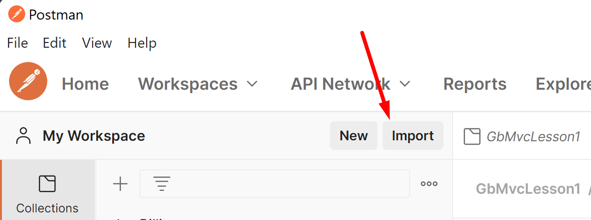
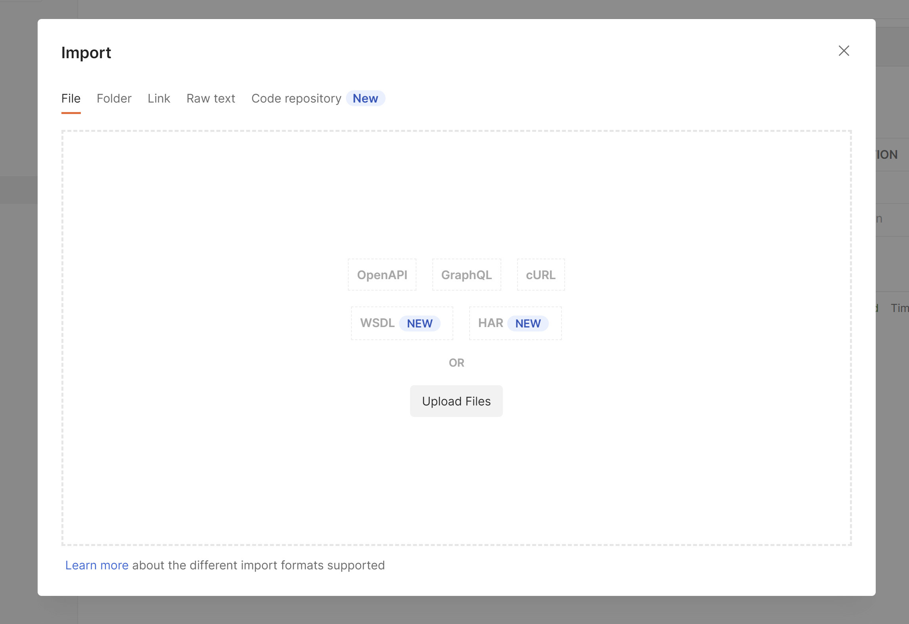
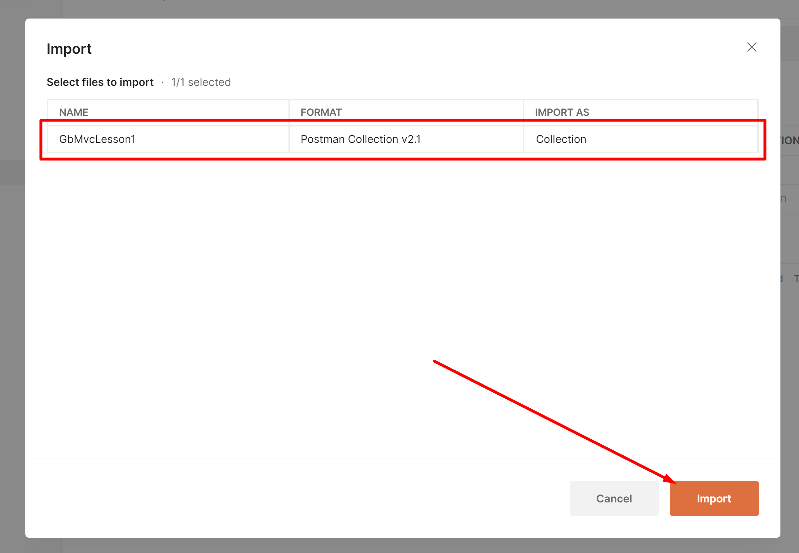
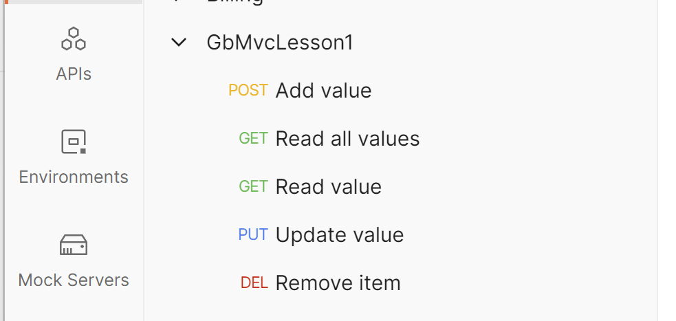

# GbMvcLesson1

Пример выполнени задания по первому уроку курса MVC.
В репозитории приведены простейшие примеры crud операций.

## Запуск проекта
Скопируйте репозиторий, откройте его через используемую IDE вы запустите проект.
Либо через командную строку перейдите в каталог проекта и выполните команду `dotnet run`
Приложение запуститься с использованием Kestrel сервера и будет доступно по адресу `http://localhost:5000/`

## Тестирование
Протестировать работу приложения можно через [Postman](https://www.postman.com/). Для этого в подготовлена коллекция запросов, которую иможно импортировать.

  
Для импорта откройте Postman и нажмите кнопку <code>Import</code>

  

  
В открывшемся окне укажите путь до файла <code>./docs/GbMvcLesson1.postman_collection.json</code> или перетащие его туда

  

  
После указания файла нажмите кнопку <code>Import</code>

  

  
После удачного импорта будет вам будет доступна коллекция запросов дл тестирования приложения

  

